<h1 align="center">Plugin Tutorial</h1>

With this file, you will learn how to use this plugin.

## Installation and requirements

To start using this extension - you can install it from [marketplace](https://marketplace.visualstudio.com/items?itemName=enfipy.plugin-polkadot). For this extension to work properly, the following prerequisites are required:

1. Visual Studio Code v1.37.0+
2. Installed [plugin dependencies](../README.md#plugin-dependencies)

To compile this plugin from sources you need the following:

1. Visual Studio Code v1.37.0+
2. Installed [plugin dependencies](../README.md#plugin-dependencies)
3. Yarn v1.13.0+
4. Installed [Substrate](https://substrate.dev/docs/en/getting-started)

## Demo with development inside docker container

To pass through this demo you need installed [Remote - Containers](https://marketplace.visualstudio.com/items?itemName=ms-vscode-remote.remote-containers) extension.

### Step 1: Configure devcontainer

To configure devcontainer you need to open the `substrate` node project and open substrate plugin `TreeView` on the sidebar. Go to panel `NODES` and click on the `...`, then select `Configure devcontainer` option.

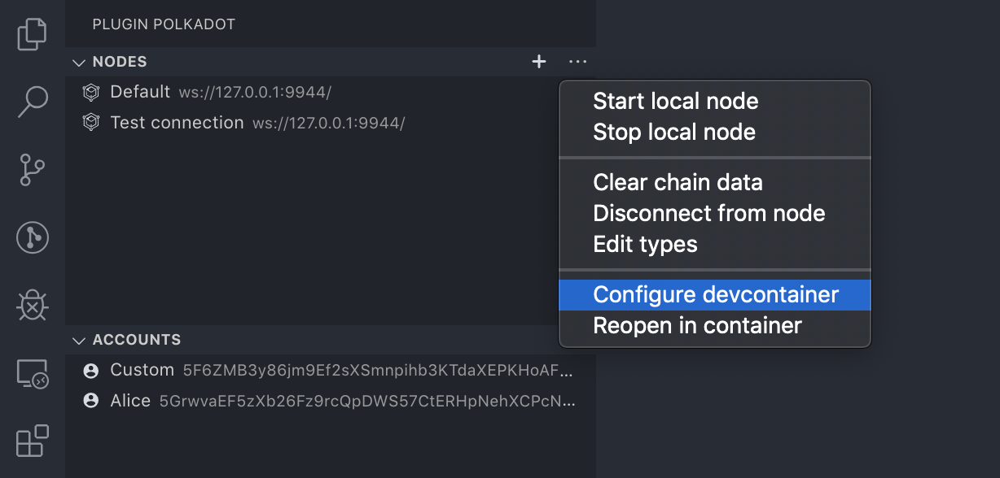

As soon as configuration will be finished the `.devcontainer` folder will show up in the root of the opened project.


### Step 2: Reopen project in dev container

To reopen your project in dev container go to `NODES` panel and click on the `...`, then select `Reopen in container`.


After vscode reopen, you'll see floating information message about building the image.


After successful build, you will able to run rust, cargo and substrate bash executables.

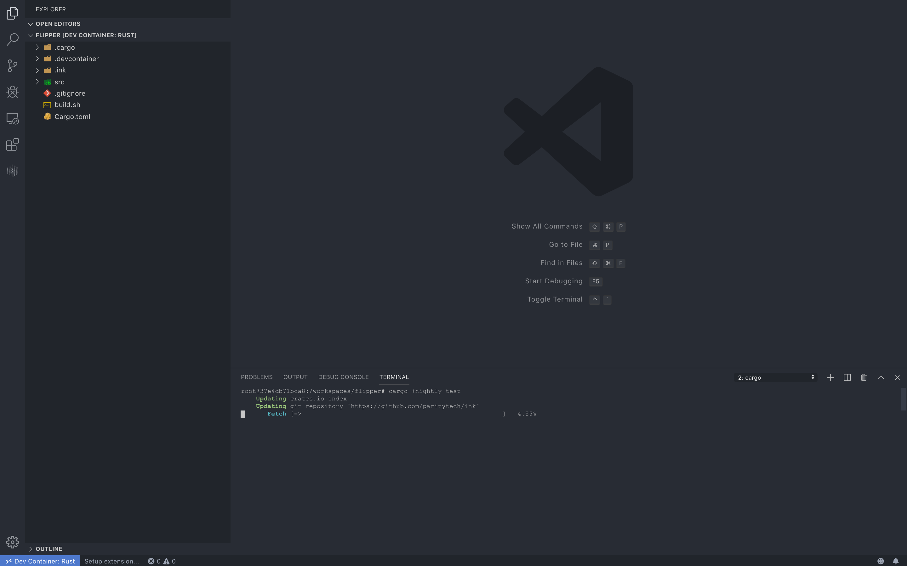

### Step 3: To upload WASM to create contract

To upload WASM you have to choose `workspaces/` folder in `root/` and then find your file.

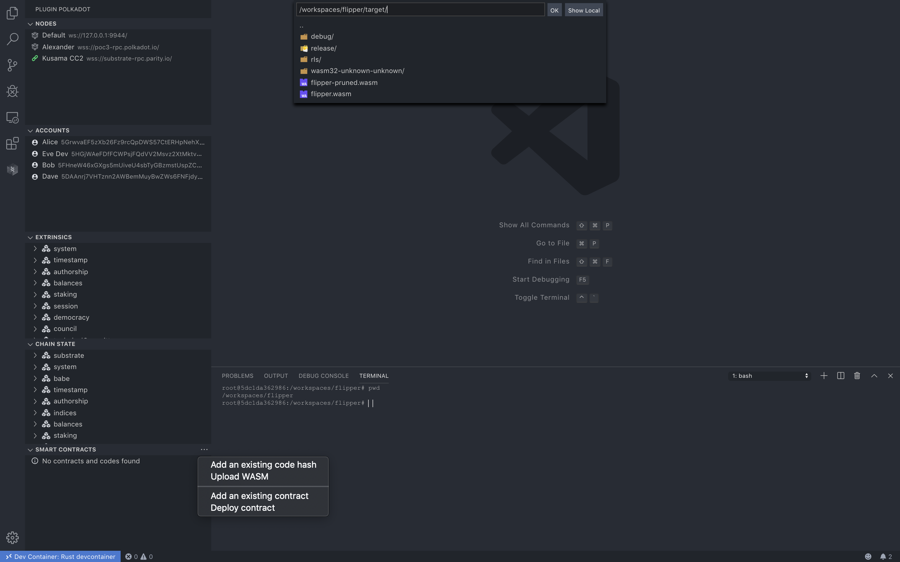

## Default demo

Let’s go through the plugin main features and see what’s happening.

### Step 1: Compilation and start

To compile this plugin:

```bash
$ git clone https://github.com/everstake/vscode-plugin-substrate.git vscode-substrate
$ cd vscode-substrate
$ yarn install
```

To run a new instance of VSCode with an installed plugin in debug mode - press `F5` or click on the debug icon (or `SHIFT + CMD + D`), choose `Run Extension` at the top of the panel and then click on the green button.

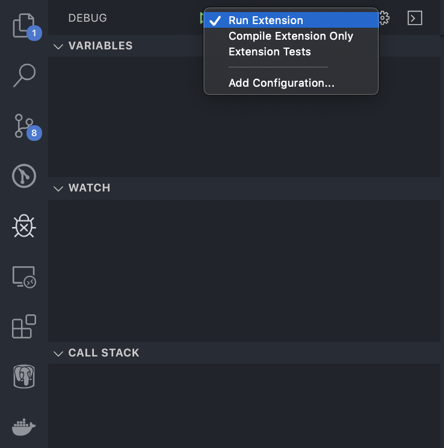

### Step 2: Run node locally

After installation or run from sources, you will see an icon on the left sidebar. If you don't see the icon - probably plugin not installed correctly or it's icon hidden. To show icon - click on the right sidebar and select `Plugin Polkadot`.

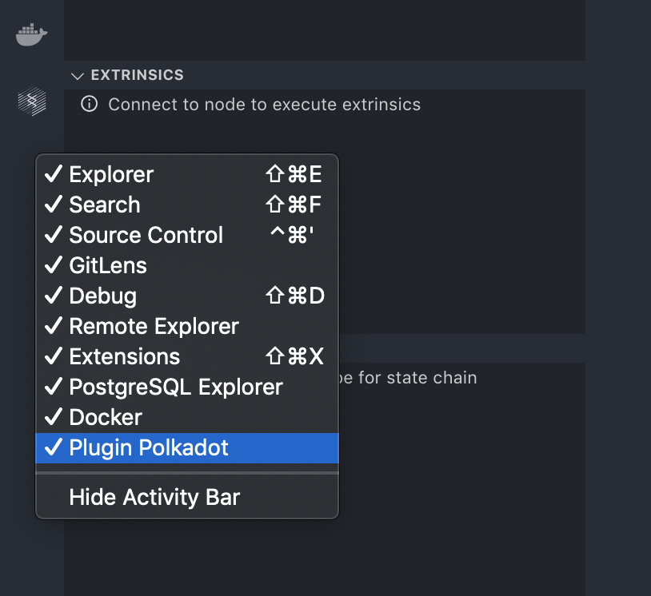

Open (or [clone](https://github.com/paritytech/substrate#51-on-mac-and-ubuntu)) substrate node (with `balances` SRML to complete this tutorial) in VSCode editor.

When you open your node sources let's start it from the plugin. On the top panel `NODES` click `...` and `Start local node`. If you see compilation logs in the terminal - you are compiling node and have to wait for its to finish.


### Step 3: Connect to node

After successful compilation of node, you can connect to it to see it's extrinsics, chain states and more.

In panel `NODES` by default plugin will add local node connection but if you want to create new click on the `+` button and type the name of node connection with its local address (by default `ws://127.0.0.1:9944/`).


After add connection let's connect to it via right-click on it and choose `Connect...` option. After a successful connection you will see extrinsics and chain states of connected node.

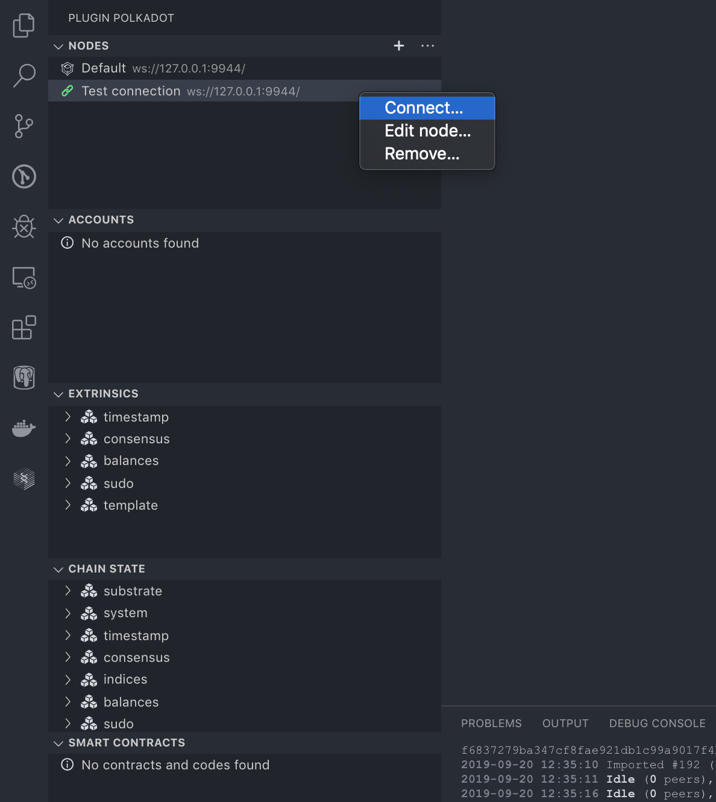

### Step 4: Add first account

After successful connection let's add an account in our plugin. To add an account with it's mnemonic/seed/URI click in `ACCOUNTS` panel on the `+` button. Type in the inputs following data: name of the account, crypto curve type, and mnemonic/seed/URI.


### Step 5: Create our own account

Now let's create a new account in our plugin. To create a new account with it's mnemonic/seed and encrypt with password click in `ACCOUNTS` panel on the `...` button and select option `Create account`. Type in the inputs following data: name of the account, crypto curve type and private key type (mnemonic or seed), private key, password.


### Step 6: Subscribe to chain state

To subscribe for chain data go to `CHAIN STATE` panel and click on the item `balances`, then in the opened tree right-click on the item `freeBalance` and click `Subscribe for data`. Select your account.

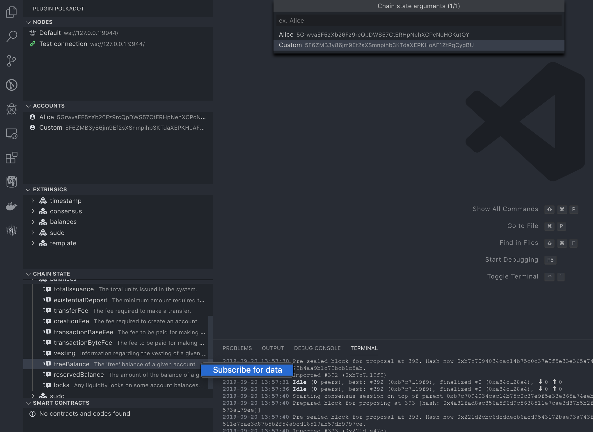

### Step 7: Copy account address

To copy account address go to `ACCOUNTS` panel and right click on your account and click on the option `Copy address...`.

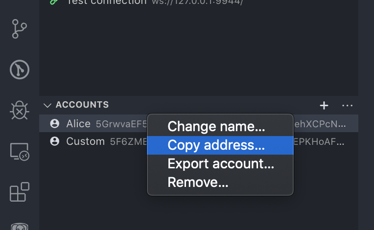

### Step 8: Execute transfer extrinsic

To execute extrinsic go to `EXTRINSICS` panel and click on the item `balances`, then in the opened tree right-click on the item `transfer` and click `Execute...`. Type in the inputs following data: address (paste it with `CMD + V`), balance (amount in `pico`), an account which will sign the transaction (select `Alice` as this account has funds by default), password (empty for `Alice`).


### Step 9: Execute transfer extrinsic

To execute extrinsic go to `EXTRINSICS` panel and click on the item `balances`, then in the opened tree right-click on the item `transfer` and click `Execute...`. Type in the inputs following data: address (paste it with `CMD + V`), balance (amount in `pico`), an account which will sign the transaction (select `Alice` as this account has funds by default), password (empty for `Alice`).


After a successful transfer, you will see the updated balance in chain state view with subscribed data.


## Demo with smart contracts

To pass through this demo you need to have installed [ink!](https://substrate.dev/substrate-contracts-workshop/#/0/setup) and have substrate project with `contracts` [SRML](https://substrate.dev/docs/en/runtime/substrate-runtime-module-library) module.

### Step 1: Connect to node

Start your local node and connect to it. If module `contracts` exists you will see chain state and extrinsics of it in `CHAIN STATE` and `EXTRINSICS` respectively.

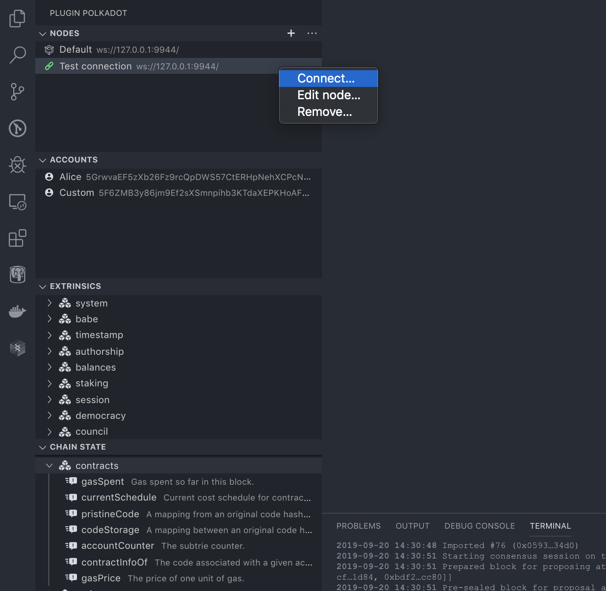

### Step 2: Compile your contract and ABI

Better to go through [this](https://substrate.dev/substrate-contracts-workshop/#/0/building-your-contract) workshop how to compile contract and ABI. In the end, you will get the next files in your target directory of the smart contract.


### Step 3: Upload WASM code to node

To upload WASM code go to `SMART CONTRACTS` panel and click on the `...` button and select `Upload WASM` option. Type in the inputs following data: file with wasm, name of the contract code, maximum gas amount, account which sign transaction, password to decrypt account.


### Step 4: Deploy contract to node

To publish a contract go to `SMART CONTRACTS` panel and click on the `...` button and select `Deploy contract` option. Type in the inputs following data: code hash, contract name, file with abi, endowment, maximum gas amount, account which sign transaction, password to decrypt account.

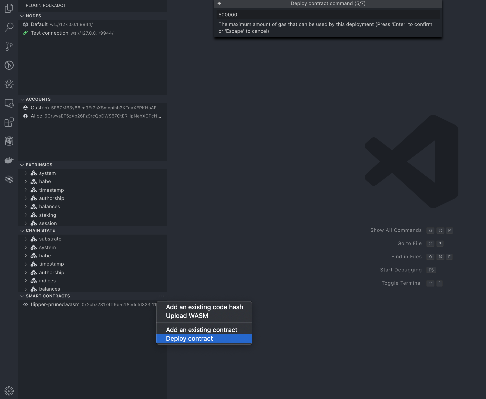

After successful deploy of contract you will see similar result to this:


### Step 5: Call contract method

To execute contract extrinsics go to `SMART CONTRACTS` panel and click on the contract and select `Call a contract method...` option. Select which method you want to execute, method arguments, endowment (balance you want to send to the smart contract), maximum gas amount, account which sign transaction, password to decrypt account.

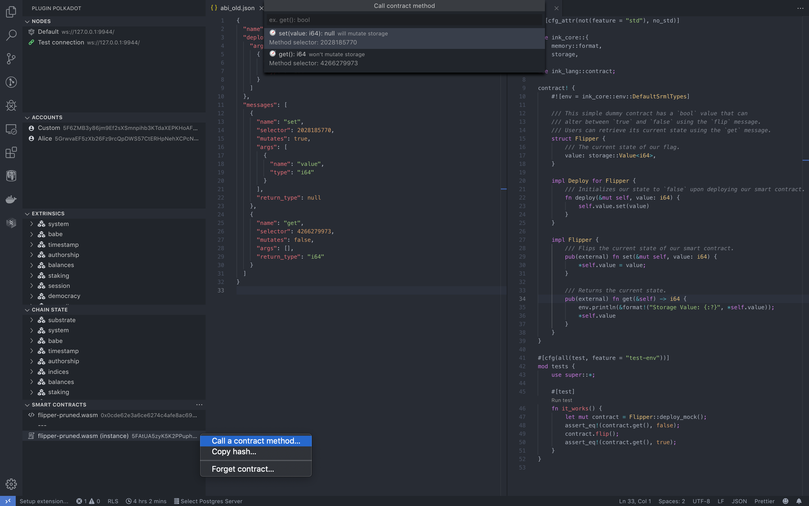
